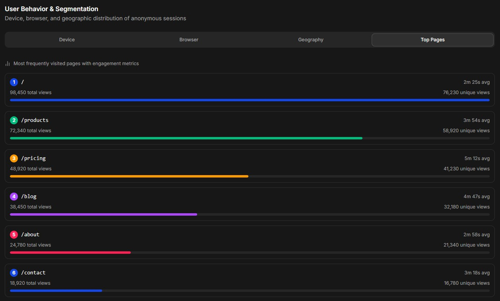
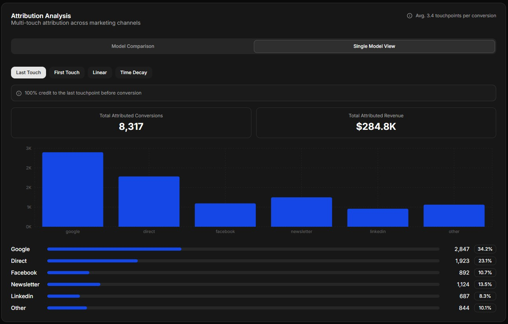
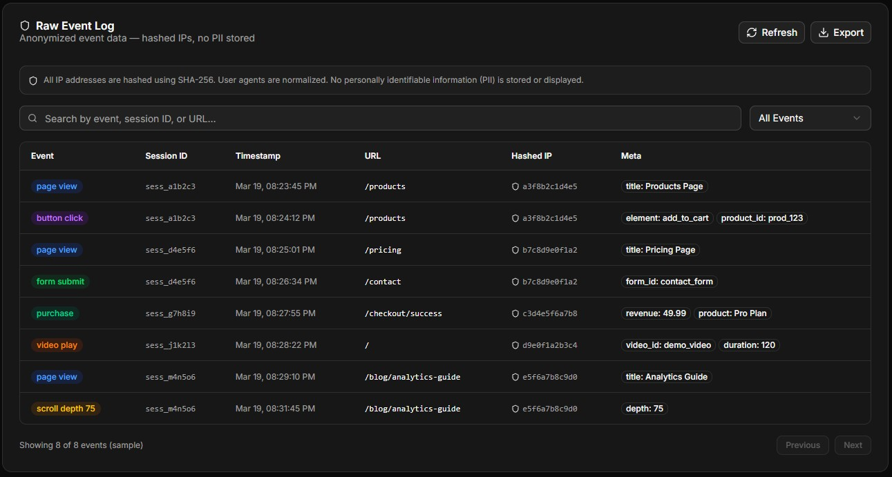
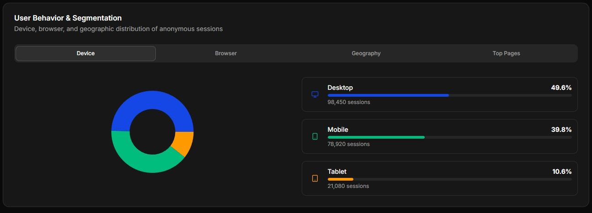

# 🚀 Cookieless Tracking & Attribution SaaS Platform

[](https://turborepo.org)
[](https://go.dev/)
[](https://www.typescriptlang.org/)
[](https://nextjs.org/)
[](https://kubernetes.io/)
[](https://workers.cloudflare.com/)

---

## 1. Project Overview

This platform is a privacy-first, cookieless event tracking and attribution system designed for the modern web. It provides a robust, scalable, and compliant solution for businesses to understand user behavior and campaign performance without relying on third-party cookies or intrusive tracking methods.

### Problem Statement

The deprecation of third-party cookies, coupled with increasing user privacy demands and stricter regulations (GDPR, CCPA, ePrivacy), has rendered traditional analytics and attribution systems less effective and often non-compliant. Businesses need a reliable way to collect first-party behavioral data, model user sessions anonymously, and accurately attribute conversions to marketing efforts in a privacy-respecting manner.

### Solution & Core Features

Our platform addresses these challenges by offering:

- **Cookieless Tracking:** Collects first-party behavioral events without using cookies or local storage, relying on advanced server-side heuristics.
- **Anonymous Session Modeling:** Generates unique, privacy-preserving session IDs based on hashed client characteristics, ensuring no persistent cross-site identifiers.
- **Flexible Attribution:** Supports various attribution models (First-Touch, Last-Touch, Time-Decay) configurable per project.
- **Real-time Analytics:** Provides low-latency dashboards for immediate insights into event streams, conversion rates, and campaign performance.
- **Privacy by Design:** Immediate IP hashing, no raw personal data storage, configurable data retention, and compliance with major privacy regulations (GDPR, CCPA).
- **Extreme Scalability:** Built on an event-driven, distributed architecture capable of handling millions of events per second.

### Architectural Principles

- **Privacy by Design:** Integrated into every layer, from ingestion to storage.
- **Stateless Ingestion:** Maximizes throughput and horizontal scalability.
- **Event Immutability:** Events are recorded as they happen, ensuring data integrity.
- **Horizontal Scalability:** All core components are designed to scale out independently.
- **Queue-Based Decoupling:** Enhances reliability, resilience, and allows for backpressure handling.
- **Write-Optimized Storage:** For high-volume raw event ingestion.
- **Low-Latency Read API:** For real-time dashboard responsiveness.
- **Domain-Driven Design (DDD):** Clear boundaries and responsibilities for each service.

---

## 2. Demo Preview

A visual overview of the platform's key screens and analytics capabilities.

<table>
  <tr>
    <td align="center" width="50%">
      <br/>
      <sub><b>User Behavior Dashboard</b></sub>
    </td>
    <td align="center" width="50%">
      <br/>
      <sub><b>Attribution Analysis</b></sub>
    </td>
  </tr>
  <tr>
      <td align="center" width="50%">
      <br/>
      <sub><b>Real-time Event Stream</b></sub>
    </td>
    <td align="center" width="50%">
      <br/>
      <sub><b>Real-time Event Stream</b></sub>
    </td>
  </tr>
</table>

---

## 3. High-Level Architecture

The system is built on an event-driven, distributed architecture with ingestion, processing, storage, and analytics layers separated for scalability and reliability.

```
graph TD
    subgraph Client Website
        A[Tracking Pixel (JS)]
    end

    subgraph Edge Network
        B[Edge / CDN Layer (Cloudflare Worker)]
    end

    subgraph Backend Services
        C[Event Ingestion API (Go)]
        D[Message Queue (Kafka)]
        E[Event Transformer (Go)]
        F[Attribution Engine (Go)]
        G[Raw Event Store (ClickHouse)]
        H[Aggregated Metrics Store (PostgreSQL)]
        I[Query API (Node.js)]
        J[Admin Service (Go)]
    end

    subgraph Analytics & Management
        K[Dashboard Frontend (Next.js)]
    end

    A --> B
    B --> C
    C --> D
    D --> E
    E --> F
    E --> G
    F --> G
    F --> H
    K --> I
    I --> H
    I --> G
    J --> H
    J --> G
```

## 4. License

This project is licensed under the [MIT License](LICENSE).